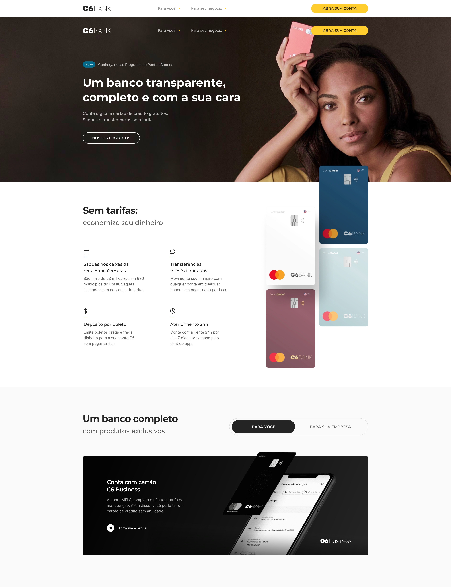
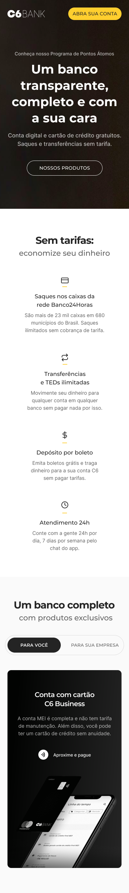

# Landing Page do Banco C6

    

Bem-vindo à Landing Page do Banco C6 - sua porta de entrada para uma experiência bancária moderna e eficiente.

## Visão Geral

Na Landing Page do Banco C6, você encontrará uma interface intuitiva e amigável, projetada para simplificar suas operações bancárias diárias. Nossa equipe de designers e desenvolvedores trabalhou arduamente para criar uma experiência que seja não apenas funcional, mas também agradável de usar.

## Principais Recursos

`Design Responsivo`: Nossa Landing Page é adaptável a todos os dispositivos, desde computadores desktop até smartphones e tablets, garantindo uma experiência consistente em qualquer lugar.

`Navegação Simplificada`: Com uma barra de navegação intuitiva e categorias bem definidas, você pode facilmente encontrar o que procura, seja abrir uma conta, verificar seu saldo ou realizar uma transferência.

`Informações Claras`: Apresentamos informações importantes de forma clara e concisa, para que você possa entender facilmente os serviços oferecidos pelo Banco C6 e tomar decisões informadas.

`Processo de Inscrição Fácil`: Quer abrir uma conta? Nosso processo de inscrição é rápido e direto, permitindo que você se torne um cliente do Banco C6 em questão de minutos, sem complicações.

`Segurança em Primeiro Lugar`: Priorizamos a segurança dos seus dados, implementando os mais recentes padrões de segurança e criptografia em todas as transações e interações

## O PROJETO

    <h3>Desktop</h3>
    
    <h3>Responsividade</h3>
    

