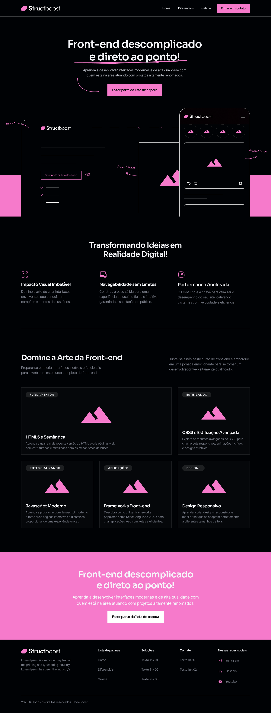
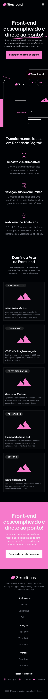

# CodeBoost

    

## Sobre o Projeto

CodeBoost é uma plataforma de apresentação de um programação de aprendizado em programação que oferece uma variedade de recursos para ajudar desenvolvedores iniciantes e experientes a aprimorar suas habilidades de codificação.

Para saber mais, visite nosso site [aqui](https://codeboost.com.br/).

    <h3>Desktop</h3>
    
    <h3>Responsividade</h3>
    

